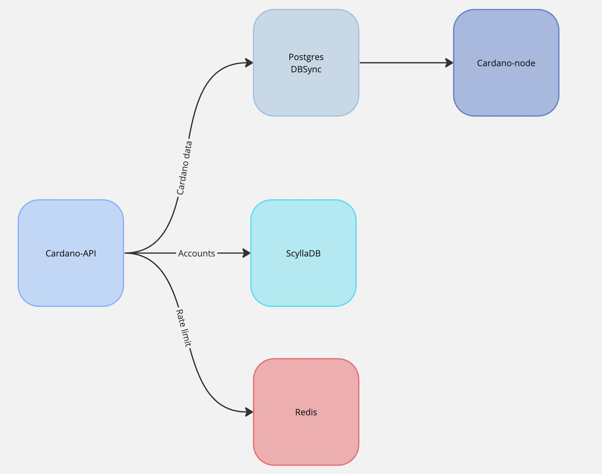

## Tangocrypto Cardano API

The Tangocrypto API serves as a backend solution built in NestJS, enabling developers to seamlessly interact with the Cardano network. With just a few simple commands, users can effortlessly deploy all essential components, laying the foundation for developing Cardano-powered applications.

## System Requirements
The system requirements for cardano-db-sync (with both db-sync and the node running on the same machine are:
- Any major Linux distribution (such as Debian, Ubuntu, RHEL, CentOS, Arch, etc.) or macOS.
- At least 16 GB of RAM for testing and 32 GB or more for production. 
- A minimum of 4 CPU cores.
- 320 gigabytes or more of disk storage, preferably SSDs.

## Getting Started
Create a new `.env` in the base directory of the project `cardano-api/.env`. For example:

```
DB_HOST=db
DB_PORT=5432
DB_NAME=cexplorer
DB_USER=postgres
DB_PWD=db_password
DB_DEBUG=false
NETWORK=preprod
REDIS_HOST=redis
REDIS_PORT=6379
SCYLLA_CONTACT_POINTS=["scylladb"]
SCYLLA_KEYSPACE="cardanodb"
SCYLLA_LOCAL_DATA_CENTER="datacenter1"
THROTTLE_LIMIT=10
THROTTLE_INTERVAL=1000
```
## Installation
To install node dependencies:

```bash
$ npm install
```

During development, you can utilize the provided data for simplicity. The API utilizes PostgreSQL for Cardano data, Redis for rate limiting, and ScyllaDB for accounts and authentication.




By default we'll working with testnet so `NETWORK=testnet`. You can switch to mainnet as well, just make sure the postgres db is using mainnet data as well. `THROTTLE_LIMIT` amd `THROTTLE_INTERVAL` are just default values for rate limit in case user doesn't specified it.

### ScyllaDB

These are the env variables related to scylladb which holds the data for the customers inside the API:

```
SCYLLA_CONTACT_POINTS=["scylladb"]
SCYLLA_KEYSPACE="cardanodb"
SCYLLA_LOCAL_DATA_CENTER="datacenter1"
```

#### Run Scylladb container using a local storage for better performance

1. Add volume directories in the local machine:

```bash
sudo mkdir -p /var/lib/scylla/data /var/lib/scylla/commitlog /var/lib/scylla/hints /var/lib/scylla/view_hints
```

2. Add filesystem permissions

```bash
sudo chmod -R 777 /var/lib/scylla
```

#### Populate the database:

```bash
docker exec -it scylladb cqlsh

// copy content inside file seeds (src/db/scylla/seeds)

```

This command will create two users with their corresponding rate limit configuration and applications. You'll need the `account-id` and `api-key` in order to query the API's endpoints (more on that bellow).

#### Run docker container:

```bash
docker compose up scylladb
```

#### Check container status:

```bash
docker exec -it scylladb nodetool status
```

#### Clear the database (this will remove everything!):

```bash
docker exec -it scylladb nodetool clearsnapshot cardanodb
```


## Running the API using Docker
To start the Cardano API run the following command:

```bash
docker compose up cardano-api
```

### Testing the API

Once the API is up and running, and the Redis, Scylladb, and Postgres containers are also running and configured, everything should be ready to start using the endpoints.

The API endpoints have the following structure (e.g `curl`):

```
curl --location 'http://localhost:3000/6e2ab6cc28d943f48a84d92ad9b5392d/blocks/latest'  --header 'x-api-key: 8120536a5efc478b92809f8f1987a76e' 

{
  "hash": "9c4b49c8a49b8031aeb03e3a47049a0bad3b49e376aeb3ffb5f61260b9f5e4af",
  "epoch_no": 67,
  "slot_no": 27689137,
  "epoch_slot_no": 386737,
  "block_no": 907742,
  "previous_block": 907741,
  "slot_leader": "pool1n84mel6x3e8sp0jjgmepme0zmv8gkw8chs98sqwxtruvkhhcsg8",
  "out_sum": 10146206,
  "fees": 171661,
  "confirmations": 1,
  "size": 238,
  "time": "2023-05-06T11:25:37.000Z",
  "tx_count": 1,
  "vrf_key": "vrf_vk126lnp0mw7nnpvhahfneffrk530lseu677pj7d3lg6xg8kj0vcgwslmu09l",
  "op_cert": "1f07eefb8caafcf96b304fb59d20d7ccba34e0ed97f72503cff281e6a4e911aa"
}
```
Where `account-id` is corresponding to the app_id on table `applications` and `x-api-key` is your `user_id` on table `subscriptions` (both tables on `scylladb`, which was populated above when setting up syclladb).

### Rate Limit
Here you can find seed credentials with their corresponding rate limits:

|  account-id | x-api-key  | |
|---|---|--|
| 6e2ab6cc28d943f48a84d92ad9b5392d  | 8120536a5efc478b92809f8f1987a76e  | 10 req/sec |
| 00000000000000000000000000000000  | 11111111111111111111111111111111  | 3 req/min  |


## Test

```bash
# unit tests
$ npm run test
```
